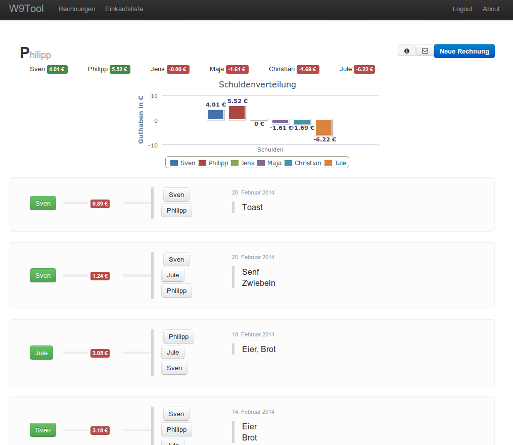

WG-Tool
=======

A web app to keep your shared expenses balanced in a flat share.

When buying stuff for the community, just enter the items and the total sum.
Then select every involved person and see the debt chart update.
Everyone involved can see the new invoice in a personal ATOM feed or get notified by mail.

The current version should always be uploaded at [wg-tool.herokuapp.com](http://wg-tool.herokuapp.com/) 

Requirements and installation
-----------------------------

### Ruby
This uses ruby v1.9.x

If you don't have ruby I'd recommend rvm.
Type the following commands to install:
``bash -s stable < <(curl -s https://raw.github.com/wayneeseguin/rvm/master/binscripts/rvm-installer )``

To use it type:
``source ~/.profile``

Install the ruby requirements. See rvm instructions. Type:
``rvm requirements``

After that install ruby and use it afterwards
``rvm install 1.9.2 && rvm use --default 1.9.2``

And bundler
``gem install bundle``

### Clone repo and prepare to run

Clone the repository:
``git clone git@github.com:master-lincoln/WG-Tool.git``

Install dependencies 
``cd WG-Tool && bundle install``

Now you can run the server with:
``HHTP_PASS=test rails s``

For the HTTP Basic login use user ``wg`` and pass ``test`` as in the command above.
